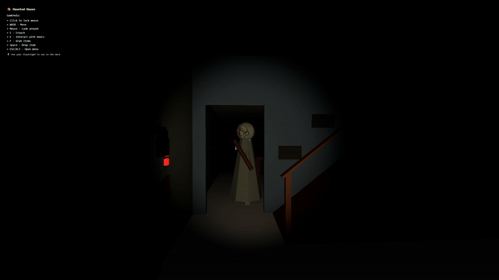

# Granny in Browser

🎮 **[Play it here](https://granny-in-browser.vercel.app)**



### 📺 [Watch how I built this](https://youtu.be/AQbuqPIbsSE)

[](https://youtu.be/AQbuqPIbsSE)

## About

You're locked inside Granny's house. Find items, solve puzzles, unlock doors, and escape — all while she hunts you through the halls. Every model, texture and the entire house layout was modeled from scratch in Blender.

## Tech Stack

- **React 19** + **TypeScript**
- **React Three Fiber** / **drei** — 3D rendering on top of Three.js
- **React Three Rapier** — physics (collisions, player movement, crouching)
- **Zustand** — game state (doors, items, locks, day/night cycle, hiding spots)
- **three-pathfinding** — Granny's AI navigation
- Custom Blender-modeled house, character and props

## Features

- First-person controller with crouch & physics-based collisions
- Item pickup, drawer & lock puzzles, hiding spots (bed, closet)
- Granny AI with pathfinding-based chase behavior
- Day-based progression and multiple difficulty levels
- Full sound design (footsteps, doors, chase stingers, etc.)

## Running locally

```bash
pnpm install
pnpm dev
```
